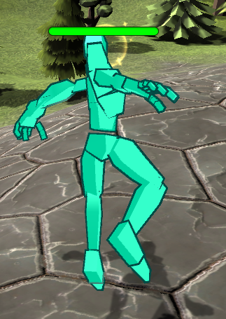

# Heroes of the Skills

## Introduction

Une armée de monstres souhaite détruire le Nexus. Pour les en empêcher, quatre héros légendaires s’allient et défendent le fort jusqu’à leur dernier souffle.

## TeamSkills

## Description

L’objectif est de mettre en scène quatre héros défendant chacun un côté du fort (Nord, Sud, Est, Ouest).
Chaque héro aura des capacités différentes (Soigneur, Tank, DPS défensif, DPS offensif, etc…).
Le jeu fonctionne par vagues d’ennemis où les héros devront tuer tous les ennemis en laissant les ennemis faire subir le moins de dégâts possible au fort. À la fin de chaque vague, des items apparaissent et les héros ont quelques secondes pour se les répartir équitablement avant l’arrivée de la prochaine vague.

Si un héros meurt, il réapparaît à la fin d’une vague. Toutefois, si les quatre héros meurent durant une même vague d’ennemis, la partie est terminée.

Enfin, si les héros parviennent à se débarrasser de toutes les vagues d’ennemis, le boss de fin de jeu apparaît et il devra être vaincu pour finir la partie.

## Fonctionnalités

### Jouable en Solo et Multiplayer

### Choix possible entre 4 classes
Les touches des sorts sont clic gauche, 1, 2, 3, 4, 5 ... en fonction des sorts disponible
Electrique

Feu

Air

Sorcière
La sorcière possède deux formes, une pour soigner, l'autre pour infliger des dégats.
Forme lumière
 
Forme ténèbre
 

### Intelligence Artificielle des monstres
L'IA des monstres a été implémentée grâce à une machine d'état ou Finite State Machine (FSM)
Les monstres se dirigent en direction du Nexus, s'ils rencontrent un ennemi, ils l'attaquent, s'ils arrivent à destination, ils attaquent le Nexus.
 

### Boucle de jeu

### A implémenter :

- Fix navmeshagent
- Evolution des spells après les rounds
- Fix d'animations en multi
- Optimisation de latence multi

